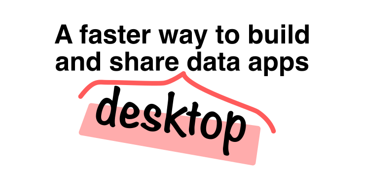

# `@stlite/desktop`



Convert your [Streamlit](https://streamlit.io/) application into a desktop app with [Stlite](https://github.com/whitphx/stlite) runtime, a [Pyodide](https://pyodide.org/)-based Wasm-port of Streamlit.

## How to create a Streamlit desktop app

1. Create the following `package.json` file to start a new NPM project. Edit the `name` field.
   ```json
   {
     "name": "xxx",
     "version": "0.1.0",
     "main": "./build/electron/main.js",
     "scripts": {
       "dump": "dump-stlite-desktop-artifacts",
       "serve": "cross-env NODE_ENV=production electron .",
       "pack": "electron-builder --dir",
       "dist": "electron-builder",
       "postinstall": "electron-builder install-app-deps"
     },
     "build": {
       "files": ["build/**/*"],
       "directories": {
         "buildResources": "assets"
       }
     },
     "devDependencies": {
       "@stlite/desktop": "^0.60.2",
       "cross-env": "^7.0.3",
       "electron": "30.0.8",
       "electron-builder": "^24.13.3"
     },
     "stlite": {
       "desktop": {
         "files": ["app.py"],
         "entrypoint": "app.py"
       }
     }
   }
   ```
2. Run `npm install` or `yarn install`.
3. Create `app.py` and write your Streamlit app code in it.
   The file name `app.py` is specified both in the `stlite.desktop.files` field in the `package.json` and the `stlite.desktop.entrypoint` field. If you want to use a different file name, change the file name in both fields.
   - `stlite.desktop.files` specifies the files and directories to be copied to the bundled desktop app.
   - `stlite.desktop.entrypoint` specifies the entry point of the Streamlit app.
4. You can add more files and directories, such as `pages/*.py` for multi-page apps, any data files, and so on, by adding them to the `stlite.desktop.files` field in the `package.json`.
   ```json
   {
     // ...other fields...
     "stlite": {
       "desktop": {
         // ...other fields...
         "files": ["app.py", "pages/*.py", "assets"]
       }
     }
   }
   ```
5. You can specify the packages to install in the desktop app by adding `stlite.desktop.dependencies` and/or `stlite.desktop.requirementsTxtFiles` fields in the `package.json`.
   - `stlite.desktop.dependencies` is an array of package names to install.
     ```json
     {
       // ...other fields...
       "stlite": {
         "desktop": {
           // ...other fields...
           "dependencies": ["numpy", "pandas"]
         }
       }
     }
     ```
   - `stlite.desktop.requirementsTxtFiles` is an array of paths to `requirements.txt` files to install the packages listed in the files.
     ```json
     {
       // ...other fields...
       "stlite": {
         "desktop": {
           // ...other fields...
           "requirementsTxtFiles": ["requirements.txt"]
         }
       }
     }
     ```
6. Run `npm run dump` or `yarn dump`.
   - This `dump` command creates `./build` directory that contains the copied Streamlit app files, dumped installed packages, Pyodide runtime, Electron app files, etc.
7. Run `npm run serve` or `yarn serve` for preview.
   - This command is just a wrapper of `electron` command as you can see at the `"scripts"` field in the `package.json`. It launches Electron and starts the app with `./build/electron/main.js`, which is specified at the `"main"` field in the `package.json`.
8. Run `npm run dist` or `yarn dist` for packaging.
   - This command bundles the `./build` directory created in the step above into application files (`.app`, `.exe`, `.dmg` etc.) in the `./dist` directory. To customize the built app, e.g. setting the icon, follow the [`electron-builder`](https://www.electron.build/) instructions.

See the [./samples](./samples) directory for sample projects.

## Use the latest version of Electron

To make your app secure, be sure to use the latest version of Electron.
This is [announced](https://www.electronjs.org/docs/latest/tutorial/security#16-use-a-current-version-of-electron) as one of the security best practices in the Electron document too.

## Use a custom Pyodide source

The `dump` command downloads some Pyodide resources such as the prebuilt package wheel files from [the JsDelivr CDN](https://pyodide.org/en/stable/usage/downloading-and-deploying.html#cdn) by default.
If you want to use a different Pyodide source, for example when accessing JsDelivr (`cdn.jsdelivr.net`) is restricted in your environment,
you can specify a URL or a path to the Pyodide source by setting the `--pyodide-source` option of the `dump` command.

For example, if you downloaded a Pyodide package from the [Pyodide releases](https://pyodide.org/en/stable/usage/downloading-and-deploying.html#github-releases) and saved it in `/path/to/pyodide/`, you can specify the URL to the Pyodide package like below.

```sh
npm run dump -- --pyodide-source /path/to/pyodide/
yarn dump --pyodide-source /path/to/pyodide/
```

## Configure the app

### Hide the toolbar, hamburger menu, and the footer

If you want to hide the toolbar, hamburger menu, and footer, add the following to your `package.json` file and run the `dump` command again. By adding the `stlite.desktop.embed` field, the dumped Streamlit app will work in the [embed mode](https://docs.streamlit.io/streamlit-community-cloud/get-started/embed-your-app#embedding-with-iframes) which hides the toolbar, hamburger menu, and footer.

```json
{
  // ...other fields...
  "stlite": {
    "desktop": {
      "embed": true
    }
  }
}
```

### File system

_Stlite_ runs your Python code on [Pyodide](https://pyodide.org/), a CPython runtime compiled to Wasm, and Pyodide's backend, Emscripten, provides a virtual file system.
When _Stlite_ runs your app, it mounts the source files onto the virtual file system, and what your Python code can access (e.g. `open("/path/to/something")`) is files and directories on the virtual file system.

The default file system ([`MEMFS`](https://emscripten.org/docs/api_reference/Filesystem-API.html#memfs)) is ephemeral, so the files saved in the directories are lost when the app is restarted. If you want to persist the files across the app restarts, you can use the IndexedDB-based file system ([`IDBFS`](https://emscripten.org/docs/api_reference/Filesystem-API.html#filesystem-api-idbfs)) or mount directories on the host OS file system to directories on the virtual file system.

#### File persistence with IndexedDB backend

You can mount the IndexedDB-based file system ([`IDBFS`](https://emscripten.org/docs/api_reference/Filesystem-API.html#filesystem-api-idbfs)) to directories on the virtual file system that your Python code can access, e.g. `open("/path/to/file")`.
You can specify the mount points via the `stlite.desktop.idbfsMountpoints` field in your `package.json` like below.
Note that you have to run the `dump` command again to apply the change.

The mounted file system is backed by IndexedDB and its data is stored in the browser's IndexedDB, so the files saved in the directories are persistent across the app restarts.

In the example below, the IndexedDB-based file system is mounted to the `/mnt` directory on the virtual file system, so that the files saved in the directory are persistent.

```json
{
  // ...other fields...
  "stlite": {
    "desktop": {
      "idbfsMountpoints": ["/mnt"]
    }
  }
}
```

#### Local file access

You can mount directories on the host OS file system to directories on the virtual file system.

To do this, you have to enable the Node.js worker mode (see the next section for details) and specify the mount points via the `stlite.desktop.nodefsMountpoints` field in your `package.json` like below.

The `nodefsMountpoints` field is an object that maps the virtual file system paths to the host OS paths.

In the example below, `"."` on the host OS file system is mounted to the `/mnt` directory on the virtual file system, so your app can access the files in `"."` on the host OS by accessing the files in `/mnt` on the virtual file system.

```json
{
  // ...other fields...
  "stlite": {
    "desktop": {
      "nodeJsWorker": true,
      "nodefsMountpoints": {
        "/mnt": "."
      }
    }
  }
}
```

### NodeJS worker mode

`@stlite/desktop` runs your app on [Electron](https://www.electronjs.org/) as a desktop app.
Electron apps have two processes: the main process which is a Node.js process running in the background, and the renderer process which is a Chromium (browser) process running the app's UI.

By default, _Stlite_ executes your Python code on Pyodide running in a [Web Worker](https://developer.mozilla.org/en-US/docs/Web/API/Web_Workers_API) dispatched by the renderer process, and the renderer process is a browser process so it's sandboxed from the host OS.

When you set the `stlite.desktop.nodeJsWorker` field in your `package.json` to `true`, _Stlite_ dispatches the worker as a [NodeJS worker](https://nodejs.org/api/worker_threads.html) that runs in the main process, which is not sandboxed, so you can mount the host OS file system to the virtual file system as described in the previous section.

```json
{
  // ...other fields...
  "stlite": {
    "desktop": {
      "nodeJsWorker": true
    }
  }
}
```

## Limitations

- Navigation to external resources like `st.markdown("[link](https://streamlit.io/)")` does not work for security. See https://github.com/whitphx/stlite/pull/445 and let us know if you have use cases where you have to use such external links.
